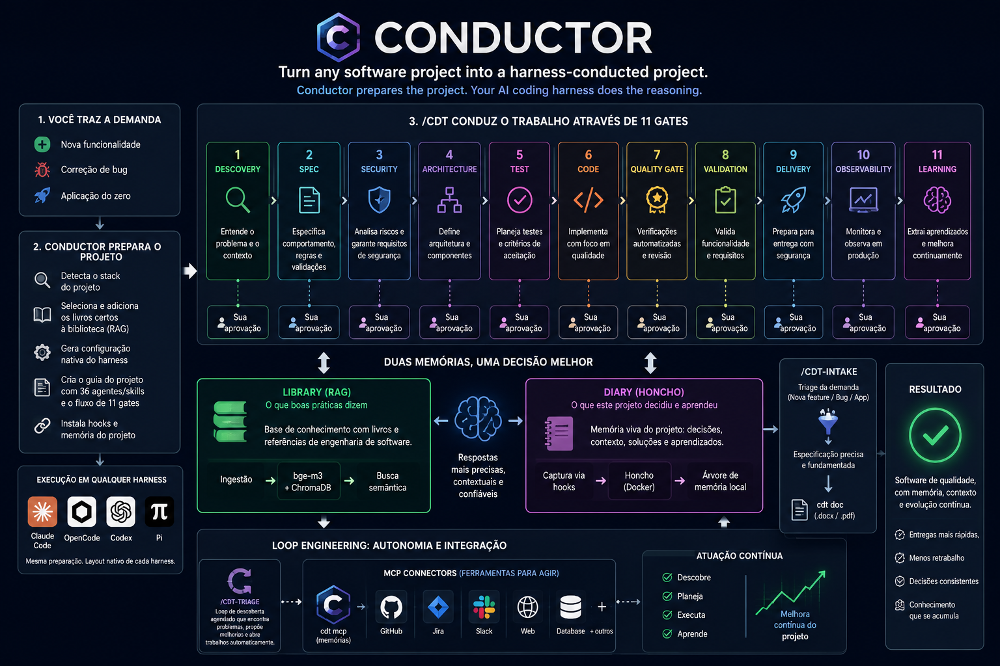

<p align="center">
  
</p>

# Conductor

> 🌐 **Idioma:** **Português (este arquivo)** · [English](README.md)

O Conductor é uma **ferramenta de linha de comando global** que transforma qualquer
projeto de software em um projeto **conduzido pelo harness**. Você roda um comando
dentro de um projeto e o Conductor faz o scaffold de configuração nativa do harness
nele: um subconjunto relevante de **36 Agentes de papéis da indústria + Skills**, a
**stack tecnológica** detectada do projeto, e um **guia de projeto** gerado que
descreve esses papéis e um **fluxo de desenvolvimento de 12 gates** (descoberta →
spec → segurança → arquitetura → teste → código → quality gate → validação →
pentest → entrega → observabilidade → aprendizado).

O Conductor conduz um projeto através de vários **harnesses de codificação com IA** —
**Claude Code** é o padrão, e **OpenCode**, **Codex** e **Pi** são suportados via
`cdt init --target` (veja [`cdt init`](#cdt-init)). O mesmo material neutro de
harness é projetado no layout nativo de cada harness.

O Conductor **não é um plugin do Claude Code**. É a ferramenta que *prepara* um
projeto. O raciocínio de fato acontece **no seu** harness (Claude Code por padrão),
guiado pela config e pelo guia local do projeto que o Conductor escreve. Duas
memórias de longo prazo fundamentam cada decisão:

| Memória | O que ela sabe | Backed por |
|--------|---------------|-----------|
| **Biblioteca (RAG)** | o que diz a boa prática de engenharia — um corpus estático de livros de referência | `cdt library` → bge-m3 + ChromaDB (Docker) |
| **Diário (Honcho)** | o que *este* projeto decidiu e aprendeu ao longo do tempo | `cdt journal` → Honcho (Docker) + uma árvore de memória local |

O trabalho é guiado pelo **comando `/cdt`**, um loop de controle interativo que
caminha uma demanda pelos gates e **para para a sua aprovação em cada um**. Um
companheiro porta-de-entrada, **`/cdt-intake`**, faz a triagem de uma demanda crua
(nova feature / correção de bug / app do zero) e produz uma spec precisa — telas →
comportamento, regras de backend → validações, fundamentada na biblioteca — que o
`cdt doc` consegue renderizar em um `.docx`/`.pdf` para um cliente não técnico.
O diário é **memória viva**: hooks do harness instalados pelo Conductor (no Claude
Code e no Pi) capturam seus prompts e injetam o que o Honcho lembra de volta em cada
nova sessão, então a memória do projeto cresce conforme você trabalha e te acompanha
entre sessões.

Para **loop engineering**, o Conductor também faz o scaffold de um contraparte
autônomo — **`/cdt-triage`**, um loop de descoberta agendado — e **conectores MCP**
(incluindo as próprias memórias do Conductor como um servidor `cdt mcp`) para que o
loop possa agir sobre ferramentas reais. Veja
[Loop engineering](#loop-engineering--triagem-autônoma--mcp).

---

## Início rápido

Da instalação à sua primeira feature (também impresso por `cdt quickstart`):

```bash
# 1. Instale (uma vez) — uma linha; veja Instalação para detalhes
#    macOS / Linux
curl -fsSL https://raw.githubusercontent.com/eltonssouza/conductor-main/main/install.sh | sh
#    Windows (PowerShell):
irm https://raw.githubusercontent.com/eltonssouza/conductor-main/main/install.ps1 | iex

# 2. Suba as duas memórias em Docker (uma vez por máquina)
cdt up                                 # RAG: Ollama + ChromaDB + ingestão do core agnóstico de linguagem
cdt library status                     # verifique o que foi ingerido
cdt honcho setup --provider deepseek   # raciocínio do diário — precisa de uma chave DeepSeek (veja abaixo); ou --provider ollama (sem chave)
cdt honcho up                          # o backend de diário Honcho

# 3. Enrole um projeto — e adicione a stack dele à biblioteca
cd /caminho/do/seu-projeto
cdt init                               # scaffold de .claude/ + .cdt/ + CLAUDE.md + /cdt + hooks
cdt detect                             # veja as linguagens/frameworks do projeto
cdt up                                 # rode de novo A PARTIR do projeto: ingere também os livros da stack dele

# 4. Recarregue o Claude Code nesse projeto  -> para o comando /cdt e os hooks carregarem

# 5. Conduza sua primeira feature pelos gates (dentro do Claude Code)
/cdt implement <sua feature>           # interativo: para para a sua aprovação em cada gate
```

> **A biblioteca se ajusta à sua stack.** `cdt up` fora de um projeto ingere apenas
> o **core** agnóstico de linguagem. Rode de novo **a partir de um projeto** e ele
> adiciona as linguagens/frameworks detectados na edição certa (um projeto Java 25 +
> Spring Boot 4 + Angular 21 adiciona Core Java, Spring Boot 3 e o guia Angular 21 —
> não as outras edições); o índice global acumula as stacks com que você trabalha.
> Escolha as tecnologias interativamente com **`cdt library stacks`** (um menu de
> toda linguagem/framework disponível + versões), ou controle direto com
> `CONDUCTOR_LIBRARY_STACKS=java@25,angular@21` (e `CONDUCTOR_LIBRARY_TIERS`);
> confira o resultado com `cdt library status`.

Úteis pelo caminho:

```bash
cdt library "<pergunta>"               # fundamente uma resposta nos livros de referência
cdt journal recall "<pergunta>"        # relembre o que este projeto já decidiu
cdt journal log --kind error,solution  # liste problemas já resolvidos
cdt sync                               # depois de atualizar o Conductor: atualize um projeto enrolado
```

> **Atualizando?** Depois de atualizar o Conductor, rode `cdt sync` em cada projeto
> enrolado para que ele receba as novidades (o driver `/cdt`, os hooks, a árvore de
> memória). Um projeto enrolado por uma versão antiga não terá `/cdt` até você
> sincronizar.

---

## Índice

1. [Início rápido](#início-rápido)
1. [Como funciona](#como-funciona)
2. [Requisitos](#requisitos)
3. [Instalação](#instalação)
4. [Os backends Docker](#os-backends-docker)
   - [Stack RAG — `cdt up`](#stack-rag--cdt-up)
   - [Backend do diário (Honcho) — `cdt honcho up`](#backend-do-diário-honcho--cdt-honcho-up)
   - [Escolhendo o provedor de raciocínio do diário](#escolhendo-o-provedor-de-raciocínio-do-diário)
5. [Usando o Conductor em um projeto](#usando-o-conductor-em-um-projeto)
   - [`cdt init`](#cdt-init)
   - [Escolhendo um harness — `--target`](#escolhendo-um-harness----target)
   - [`cdt sync` — o CLAUDE.md vivo](#cdt-sync--o-claudemd-vivo)
6. [O fluxo de 12 gates](#o-fluxo-de-12-gates)
7. [Loop engineering — triagem autônoma & MCP](#loop-engineering--triagem-autônoma--mcp)
8. [A porta de entrada intake — triagem & documentos de spec](#a-porta-de-entrada-intake--triagem--documentos-de-spec)
9. [Odysseus (opcional) + o servidor MCP standalone](#odysseus-opcional--o-servidor-mcp-standalone)
10. [A biblioteca (Chroma) — fundamentando respostas](#a-biblioteca-chroma--fundamentando-respostas)
11. [O diário (Honcho) — memória do projeto](#o-diário-honcho--memória-do-projeto)
12. [Referência da CLI](#referência-da-cli)
13. [Configuração (variáveis de ambiente)](#configuração-variáveis-de-ambiente)
14. [Layout do repositório](#layout-do-repositório)
15. [Invariantes / quality gate](#invariantes--quality-gate)
16. [Solução de problemas](#solução-de-problemas)
17. [Notas de segurança](#notas-de-segurança)

---

## Como funciona

```
                ┌───────────────────────────────────────────────────────┐
                │  cdt  (CLI global, instalado com o one-liner / uv)    │
                └───────────────────────────────────────────────────────┘
                      │                    │                    │
        cdt init        cdt library    cdt journal
                      │                    │                    │
                      ▼                    ▼                    ▼
        Gera dentro do projeto       Consulta a stack     Registra / relembra
        alvo:                        RAG (Chroma +        decisões do projeto
          .claude/agents+skills      bge-m3 na GPU)       (Honcho + espelho
          .cdt/ (stack, diário)             │             JSONL local)
          CLAUDE.md (o fluxo)               │                    │
                      │                    └──────┬─────────────┘
                      ▼                           ▼
            Abra o projeto no Claude Code. Os agents/skills com escopo de
            projeto em `.claude/` carregam automaticamente (sem plugin).
            O CLAUDE.md vira contexto do projeto, e os agentes fundamentam
            cada gate nas duas memórias.
```

O raciocínio é feito pelo Claude Code lendo o `.claude/` e o `CLAUDE.md` gerados. O
Conductor em si **não contém LLM** — ele faz scaffold, indexa e lembra. Cada agente
gerado declara um tier `model:` (`opus` para arquitetura/segurança/estratégia,
`sonnet` para implementação, `haiku` para facilitação leve), então o Claude Code roda
cada papel em um modelo do tamanho certo.

---

## Requisitos

- **Python 3.9+** (a CLI é puro standard library; os extras RAG/diário puxam
  `chromadb` / `honcho-ai`).
- **Docker + Docker Compose** — para a stack RAG e o backend de diário Honcho.
- **Git** — as imagens Docker do Conductor são construídas a partir do código
  local / um clone local.
- **Uma GPU NVIDIA + o NVIDIA Container Toolkit** *(recomendado, opcional)* — para o
  modelo de embedding `bge-m3` rodar na GPU. Sem ela, a primeira ingestão completa do
  corpus leva horas na CPU.
- **Uma chave de API para o provedor de diário escolhido — ou nenhuma, se você
  escolher a opção Ollama local.** O recall inteligente do Honcho é movido por um LLM
  que você escolhe no setup (OpenAI, DeepSeek, OpenRouter, Anthropic, qualquer
  endpoint compatível com OpenAI, ou Ollama local). Provedores hospedados precisam de
  uma chave; a opção Ollama local funciona **sem chave nenhuma** (o modelo local
  pequeno dá resultados mais fracos). Veja
  [Escolhendo o provedor de raciocínio do diário](#escolhendo-o-provedor-de-raciocínio-do-diário).
- **O corpus de livros de referência** — os livros em markdown que o RAG indexa.
  `cdt up` os busca automaticamente do repositório público da biblioteca
  ([`eltonssouza/conductor-library`](https://github.com/eltonssouza/conductor-library));
  nada para baixar à mão. Aponte para um fork/branch com `CONDUCTOR_LIBRARY_REPO` /
  `CONDUCTOR_LIBRARY_REF`.

---

## Instalação

Uma linha. O instalador checa pré-requisitos, instala [uv](https://astral.sh/uv)
(isolado, sem sudo), clona o Conductor em `~/.conductor/src`, e instala os comandos
`cdt` / `conductor` como uma ferramenta editável — para que os backends Docker
funcionem também. Rode de novo a qualquer momento para atualizar.

```bash
# macOS / Linux
curl -fsSL https://raw.githubusercontent.com/eltonssouza/conductor-main/main/install.sh | sh
```

```powershell
# Windows (PowerShell)
irm https://raw.githubusercontent.com/eltonssouza/conductor-main/main/install.ps1 | iex
```

Knobs (variáveis de ambiente): `CONDUCTOR_REF` (branch/tag), `CONDUCTOR_SRC`
(diretório do clone), `CONDUCTOR_EXTRAS` (padrão `rag,honcho`; use `none` para uma
instalação só-core), `CONDUCTOR_DRY_RUN=1` (preview sem mudar nada), `NO_COLOR=1`.

Faça preview da instalação Windows em um sandbox descartável primeiro (nada toca seu
PATH ou `~/.conductor`):
`powershell -ExecutionPolicy Bypass -File tools/simulate-install.ps1 -Init`.

<details>
<summary>Instalação manual (a partir de um clone)</summary>

Os backends Docker são construídos a partir do código, então um clone é necessário
para rodá-los:

```bash
git clone https://github.com/eltonssouza/conductor-main.git
cd conductor-main
uv tool install --editable ".[rag,honcho]"   # ou: pipx install --editable ".[rag,honcho]"
```

`[rag]` adiciona o cliente ChromaDB + scikit-learn/numpy (`cdt library`; os dois
últimos também são usados pelo projeto separado `conductor-viewer`);
`[honcho]` adiciona o SDK do Honcho (`cdt journal recall`). Omita-os para uma CLI
só-core.
</details>

Isso te dá o comando `cdt` (com `conductor` mantido como alias). Verifique:

```bash
cdt --help
```

---

## Os backends Docker

As duas memórias de longo prazo do Conductor rodam em Docker. Cada uma é um único
comando.

### Stack RAG — `cdt up`

Constrói e inicia o RAG da biblioteca: **Ollama** (servindo o modelo de embedding
`bge-m3`), **ChromaDB** (o vector store), e um serviço **conductor** de uma só vez
que busca os livros, puxa o modelo e ingere tudo.

```bash
# O corpus de livros é buscado do repo público da biblioteca automaticamente —
# nada local para colocar. (Sobrescreva com CONDUCTOR_LIBRARY_REPO / _REF.)
cdt up                    # attached (acompanhe o progresso)
cdt up -d                 # detached  (depois: docker compose logs -f conductor)
cdt down                  # para a stack
cdt ingest                # re-roda só a ingestão (idempotente)
```

`cdt up` automaticamente:

- **detecta uma GPU NVIDIA** + o runtime NVIDIA do Docker e habilita a GPU para o
  Ollama (≈0,5 s por embed); senão imprime que está rodando na CPU;
- **busca os livros** do repo da biblioteca (`CONDUCTOR_LIBRARY_REPO@REF`, padrão
  [`eltonssouza/conductor-library`](https://github.com/eltonssouza/conductor-library));
- **auto-seleciona o corpus para sua stack** — rode a partir de um projeto e ele
  detecta as linguagens/frameworks e ingere só os livros correspondentes mais o core
  agnóstico de linguagem (`cdt detect` faz preview da escolha; a escolha acumula
  entre projetos). Fixe explicitamente com `CONDUCTOR_LIBRARY_STACKS` / `_TIERS`;
- roda o bootstrap e imprime o progresso de cada passo:

```
[1/4] fetching library from eltonssouza/conductor-library@main ... 136 .md books
[2/4] pulling bge-m3:  73.4%
      bge-m3 on GPU (0.7 GB VRAM) — fast embeds
[3/4] ChromaDB is up
[4/4] ingesting books ... 60349 chunks indexed
[done] RAG stack ready
```

O bootstrap é **idempotente**: pula uma biblioteca já populada, pula um modelo já
puxado, e faz upsert no índice — então uma execução interrompida resume. Depois que
termina, o serviço `conductor` sai; **Ollama e ChromaDB continuam rodando** para
servir consultas. ChromaDB é exposto em `localhost:8001`, Ollama em `localhost:11434`
(ambos bound só ao localhost).

### Backend do diário (Honcho) — `cdt honcho up`

[Honcho](https://honcho.dev) é a memória de longo prazo por trás do diário: armazena
as mensagens do journal e raciocina sobre elas em segundo plano, para que
`cdt journal recall` responda por *significado*, não palavras-chave. O espelho JSONL
local do diário funciona sem o Honcho, então este backend é **opcional** — ele
adiciona recall inteligente por cima.

```bash
pip install -e .[honcho]                       # o SDK do Honcho
cdt honcho setup                         # escolha um provedor de raciocínio, escreve o .env (veja abaixo)
cdt honcho up                            # clona + constrói + inicia (um comando)
cdt honcho down                          # para
```

`cdt honcho up` faz tudo o que a stack precisa automaticamente — clona o Honcho se
faltar, corrige os finais de linha CRLF do Windows que quebram o entrypoint do
container, constrói a partir do clone local, sobe a stack (api + deriver +
Postgres/pgvector + Redis), e — em um banco novo — reconfigura a dimensão do vetor
para 1024 para os embeddings `bge-m3` locais.

> **Nota:** rode `cdt up` também. O Honcho embeda suas mensagens usando o mesmo
> `bge-m3` local que o Ollama da stack RAG serve.

**Raciocínio vs. embeddings.** `cdt honcho setup` traz presets para
`openai | deepseek | openrouter | ollama | anthropic | custom`. Porque a maioria dos
provedores não-OpenAI (DeepSeek, Anthropic, OpenRouter, …) não tem API de embeddings
compatível, o Conductor usa um **híbrido** por padrão:

- **Raciocínio** (deriver + dialectic + summary) → o provedor que você escolheu (ex.
  DeepSeek `deepseek-chat`, OpenAI `gpt-4o-mini`, um modelo Ollama local).
- **Embeddings** → o **`bge-m3` do Ollama local** (grátis, 1024-d). Só o provedor
  `openai` usa o `text-embedding-3-small` hospedado da OpenAI (1536-d).

### Escolhendo o provedor de raciocínio do diário

O LLM que move o raciocínio em segundo plano do Honcho **não é embutido** — você o
escolhe no setup. Rode interativamente ou passe um provedor:

```bash
cdt honcho setup                         # seletor interativo (lista todos os provedores)
cdt honcho setup --provider ollama       # local, SEM CHAVE DE API (o começo mais fácil)
cdt honcho setup --provider deepseek     # hospedado; chave auto-resolvida (veja abaixo)
cdt honcho setup --provider openai   --model gpt-4o-mini --api-key sk-...
cdt honcho setup --provider openrouter --model google/gemini-2.5-flash --api-key sk-or-...
cdt honcho setup --provider anthropic  --model claude-haiku-4-5 --api-key sk-ant-...
cdt honcho setup --provider custom --base-url https://my-gateway/v1 --model my-model --api-key sk-...
```

| Provedor | Endpoint | Precisa de chave? |
|----------|----------|--------------|
| `ollama` | **local** `host.docker.internal:11434` | **Não** — roda na sua máquina |
| `openai` | `api.openai.com` | Sim |
| `deepseek` | `api.deepseek.com` | Sim |
| `openrouter` | `openrouter.ai` | Sim |
| `anthropic` | API nativa da Anthropic | Sim |
| `custom` | **seu** `--base-url` (vLLM, LM Studio, Groq, Together, um gateway…) | geralmente |

Qualquer endpoint compatível com OpenAI funciona via `--provider custom --base-url
<url> --model <id> [--api-key <key>]` — sem preset embutido necessário.

**Ollama local — a escolha sem chave de API.** Aponte o raciocínio do Honcho para um
modelo rodando na sua própria máquina; nada sai da sua máquina e não há chave para
gerenciar:

```bash
docker exec conductor-ollama-1 ollama pull qwen2.5:3b   # um modelo de chat com suporte a tools
cdt honcho setup --provider ollama --model qwen2.5:3b   # ou llama3.1, etc.
cdt honcho up
```

> O modelo é puxado **para dentro do Ollama dockerizado** (`conductor-ollama-1`,
> iniciado por `cdt up`) — não uma instalação no host — então o mesmo Ollama serve
> tanto o `bge-m3` (embeddings) quanto seu modelo de raciocínio.

**Trocando de um provedor já configurado** (ex. DeepSeek → Ollama). O `.env` já
existe, então o `cdt honcho setup` se recusa a sobrescrevê-lo sem `--force`:

```bash
docker exec conductor-ollama-1 ollama pull qwen2.5:3b           # o modelo vive no container
cdt honcho setup --provider ollama --model qwen2.5:3b --force   # --force sobrescreve o .env existente
cdt honcho down && cdt honcho up                               # o container lê o .env só na subida
```

Trocar entre provedores que compartilham o **mesmo embedding** (`bge-m3`, 1024-d — o
padrão para todo provedor não-OpenAI) **não requer recriar o volume**; o diário é
mantido. Só mudar a dimensão do embedding exigiria.

**Resolução de chave (qualquer provedor hospedado).** Quando uma chave é necessária,
o `cdt honcho setup` a resolve nesta ordem e a escreve no `.env` (gitignored) do
Honcho — a chave nunca é impressa:

1. **`--api-key …`** na linha de comando, ou
2. a **variável de ambiente** `CONDUCTOR_<PROVIDER>_API_KEY` (ex.
   `CONDUCTOR_OPENAI_API_KEY`) — ou a variável de transporte do provedor
   (`LLM_OPENAI_API_KEY` / `LLM_ANTHROPIC_API_KEY`), ou
3. um **arquivo de chave por provedor** `~/.conductor/<provider>-key.txt`
   (sobrescreva o caminho com `CONDUCTOR_<PROVIDER>_API_KEY_FILE`). O arquivo guarda
   um token — uma linha pura, `NAME=token`, ou `NAME: "token"`. O arquivo legado do
   DeepSeek `~/.conductor/deepseek-key.txt` (variável `API-KEY-DEEP_SEEK`,
   `CONDUCTOR_DEEPSEEK_KEY_FILE`) ainda funciona, ex.:
   ```
   API-KEY-DEEP_SEEK: "sk-sua-chave-deepseek"
   ```
4. senão ele **pergunta** (interativo) ou escreve um placeholder
   `set-your-<provider>-key` que você preenche no `.env` antes de `cdt honcho up`.

---

## Usando o Conductor em um projeto

### `cdt init`

Rode dentro do projeto que você quer conduzir:

```bash
cd /caminho/do/seu-projeto
cdt init                       # detecta tipo + stack, faz scaffold de tudo
cdt init --all                 # scaffold dos 36 papéis (padrão: um subconjunto relevante)
cdt init --roles backend-engineer,security-engineer,quality-assurance
cdt init --type backend --force   # força o tipo / re-inicializa
```

Ele detecta o tipo do projeto pelos manifests (Angular/React/Vue/Next,
Maven/Gradle/Go/Python/.NET/Rust, Flutter/React-Native/Xcode…) e gera, **dentro do
projeto**:

```
<projeto>/
  CLAUDE.md                     # o guia do projeto: papéis + memória + o fluxo de 12 gates + CLI
  .claude/
    agents/<role>.md            # um subconjunto relevante dos Agentes de papéis (o Claude Code carrega)
    skills/<skill>/SKILL.md     # as Skills correspondentes
    commands/cdt.md             # o driver do fluxo /cdt (o loop interativo de gates)
    commands/cdt-triage.md      # o loop de descoberta autônomo /cdt-triage (loop engineering)
    settings.local.json         # hooks machine-local: captura Honcho + injeção de contexto
  .mcp.json                     # MCP: as memórias do Conductor como servidor (cdt mcp)
  .mcp.connectors.example.json  # stubs desabilitados de conectores GitHub/Slack/... para copiar
  .cdt/
    config.json                 # enrollment: slug, tipo, papéis selecionados, workspace Honcho
    stack/<TYPE>.md             # as tecnologias detectadas (direciona as queries RAG)
    memory/                     # a árvore de memória do projeto:
      diary/                    #   diário de máquina append-only (JSONL, local)
      daily/                    #   digests legíveis por humanos gerados do diário
      docs/                     #   conhecimento vivo (arquitetura/api/db/ops), ingerido no Honcho
      records/                  #   artefatos datados: bugs, ADRs, descoberta, features, gaps
      refs/                     #   ponteiros para sistemas externos (Jira/PRD/SQL/imagens), nunca ingeridos
      _index.md                 #   um mapa vivo do que cada pasta guarda
```

`.claude/agents` e `.claude/skills` são **diretórios do Claude Code com escopo de
projeto**, então quando você abre o projeto no Claude Code eles são carregados
automaticamente — **sem plugin necessário**. O subconjunto de papéis é escolhido pelo
tipo do projeto (um projeto frontend recebe FE/UXD/UID/UXR + os papéis core de
engenharia/qualidade/segurança; um projeto backend recebe BE/SA/DBA/AppSec/SRE +
core; etc.). Use `--all` para todo papel ou `--roles` para escolher exatamente.

Depois de inicializar, abra o projeto no seu harness. O guia do projeto (`CLAUDE.md`,
ou `AGENTS.md` para os harnesses não-Claude) vira o contexto do projeto e instrui o
harness a conduzir o trabalho pelos gates enquanto fundamenta as decisões nas duas
memórias.

> O layout acima (`.claude/` + `CLAUDE.md`) é o que o target **padrão** Claude Code
> produz. Os outros harnesses recebem o mesmo material no seu próprio layout nativo —
> veja [Escolhendo um harness](#escolhendo-um-harness----target) abaixo.

### Escolhendo um harness — `--target`

O mesmo material neutro de harness (os Agentes/Skills de papéis, o driver de fluxo
`/cdt`, e o guia do projeto) é projetado por harness por um adaptador. Escolha um ou
mais com `--target`:

```bash
cdt init                                   # auto-detecta o harness presente, senão claude
cdt init --target claude                   # o padrão
cdt init --target opencode
cdt init --target codex,pi                 # lista por vírgula — emite vários de uma vez
cdt init --target all                      # todo harness suportado
```

| Target | Layout que produz | Guia do projeto |
|--------|--------------------|---------------|
| `claude` *(padrão)* | `.claude/` — `agents/` + `skills/` + `commands/cdt.md` + `settings.local.json` (hooks) | `CLAUDE.md` |
| `opencode` | `.opencode/` — `agents/` + `skills/` + `commands/cdt.md` + `plugins/` (hook de memória viva); `opencode.json` registra o guia | `AGENTS.md` |
| `codex` | `.agents/skills/` — papéis dobrados em skills nativas (`$skill`-invocáveis), incl. `cdt` como `$cdt` | `AGENTS.md` |
| `pi` | `.pi/` — `skills/` + `prompts/cdt.md` + `extensions/` (hook de memória viva) | `AGENTS.md` |

Notas:

- **O padrão é auto-detectar.** Sem `--target`, o Conductor emite para qualquer
  harness que já encontre no projeto (ex. um `.opencode/` ou `AGENTS.md` existente);
  se não detecta nenhum, cai para **Claude Code**.
- **O arquivo de guia difere por harness.** Só o target Claude escreve `CLAUDE.md`;
  OpenCode, Codex e Pi escrevem **`AGENTS.md`** no lugar.
- **Papéis vs. skills.** Claude Code e OpenCode têm subagents auto-carregados, então
  um papel vem como seu próprio Agent. Codex e Pi não têm auto-subagents, então a
  persona de cada papel é **dobrada em sua skill**.
- **Memória viva** (os hooks de captura/injeção do Honcho) é instalada para os
  harnesses que a suportam — **Claude Code** e **Pi**.
- **A escolha persiste.** As chaves de target selecionadas são escritas em
  `.cdt/config.json`, então [`cdt sync`](#cdt-sync--o-claudemd-vivo) re-emite o(s)
  mesmo(s) harness(es). Passe `--target` ao `sync` para mudar o conjunto.

### `cdt sync` — o CLAUDE.md vivo

O `CLAUDE.md` gerado é um **documento vivo e padronizado**. Uma região gerenciada
(delimitada por `<!-- conductor:managed:start --> … <!-- conductor:managed:end -->`)
é de propriedade do Conductor; qualquer coisa que você escreva **abaixo do marcador
final é preservada**.

```bash
cdt sync               # re-detecta a stack, atualiza os papéis, puxa a memória do diário
```

`sync` regenera apenas a região gerenciada: re-detecta a stack, re-seleciona o
subconjunto de papéis (se o tipo do projeto mudou), e puxa as decisões mais recentes
do diário para um bloco "Project memory". Ele re-emite para o(s) **harness(es)
configurado(s) em `.cdt/config.json`** (passe `--target` para mudá-los). Registrar
uma entrada no journal (`cdt journal add`) também atualiza esse bloco
automaticamente, então o arquivo fica atual conforme o projeto evolui.

---

## O fluxo de 12 gates

O `CLAUDE.md` gerado instrui o Claude a conduzir cada demanda por 12 gates, **em
ordem**, delegando aos papéis certos em cada passo e se recusando a avançar até o
critério de saída do gate ser atendido.

| # | Gate | Papéis líderes | Critério de saída |
|---|------|-----------|----------------|
| 1 | Descoberta e modelagem de domínio | PM, PO, BA, UX Researcher | problema & hipótese declarados; linguagem ubíqua; atores & regras identificados |
| 2 | Especificação (fonte da verdade) | PO, BA, QA | cada item tem critérios de aceite **testáveis** com exemplos Given/When/Then |
| 3 | Segurança & privacidade by design | Security Eng, AppSec, DPO, CISO | ameaças modeladas (STRIDE), mitigações & defaults seguros; tratamento lícito de dados |
| 4 | Arquitetura & design defensivo | Software/Solutions/Enterprise Architect, Tech/Staff/Principal | ADRs registrados; fronteiras & modos de falha definidos |
| 5 | Test-first / spec executável | SDET, QA, SWE | testes derivados dos critérios de aceite, **falhando antes** da implementação |
| 6 | Implementação (clean code) | SWE, FE, BE, FSE | testes verdes; código legível, refatorado; edge cases tratados |
| 7 | CI + quality gate | DevOps, Platform Eng, SDET | pipeline verde (build + testes + análise estática); bloqueia merge na falha |
| 8 | Validação contra a spec | QA, BA, PO | cada critério de aceite verificado contra o resultado |
| 9 | Pentest & hardening de infra | AppSec, Security Eng, SRE, CISO | app pentestado (OWASP/ASVS) & VPS endurecida; nenhum critical/high aberto; achados corrigidos ou risco aceito |
| 10 | Entrega progressiva | DevOps, Platform Eng, SRE | estratégia de rollout (flag/canary/blue-green) com rollback automático |
| 11 | Observabilidade & operação | SRE, DevOps | SLIs/SLOs instrumentados; alertas acionáveis, baseados em sintoma |
| 12 | Aprendizado contínuo | SRE, Eng Manager, Agile Coach | postmortem sem culpa; cada aprendizado realimentado como nova spec/teste (loop → Gate 2) |

**Rode com `/cdt`.** O fluxo é guiado pelo comando **`/cdt <demanda>`** (instalado em
`.claude/commands/`). É o loop de controle que transforma o fluxo de orientação
passiva em passos forçados — e é **interativo por design**, parando para a sua
aprovação em cada gate. Conduzir uma demanda de qualquer outra forma (ou parear
`/cdt` com "rode autonomamente / commite cada passo") deixa os gates como texto
passivo que um prompt normal vai contornar.

**Protocolo obrigatório de gate.** Em cada gate o fluxo exige cinco passos antes de
avançar — eles são parte do critério de saída, não sugestões opcionais:

1. **Recall** do contexto anterior — `cdt journal recall "<a pergunta do gate>"`.
2. **Fundamentar** afirmações na biblioteca — `cdt library --gate N "<pergunta>"` e
   **cite o livro** para cada decisão não trivial. Uma afirmação sem citação reprova
   o gate.
3. **Delegar** o trabalho aos papéis do gate **via a Task tool (como subagents)**,
   não inline — para que cada Agent rode em seu tier `model` declarado
   (opus/sonnet/haiku), sobrescrevendo o padrão da sessão.
4. **Registrar** decisões/erros/soluções-chave — `cdt journal add --gate N --kind
   decision "…"`.
5. **Parar** em um checkpoint do usuário — apresente as decisões, citações e riscos
   abertos, então **peça sua aprovação** antes do próximo gate começar.

Isso fecha o loop: os aprendizados do Gate 12 fluem de volta para o Gate 2 no próximo
ciclo, e cada loop baixa a taxa de defeitos.

---

## Loop engineering — triagem autônoma & MCP

`/cdt` é interativo (para em cada gate). Sua **contraparte agendada** é
**`/cdt-triage`** — um loop de descoberta autônomo que você roda sem supervisão em
cadência (`/loop`, uma tarefa cron, ou uma automação do harness como a aba
Automations do Codex). Ele:

1. **relembra** o estado anterior do diário,
2. **escaneia** falhas de CI recentes, issues abertas e commits recentes (Gate 1),
3. **faz triagem** de cada achado em `worth-doing | needs-human | noise`,
4. entrega trabalho acionável a um subagent **maker** **em um git worktree isolado**
   (para que o trabalho paralelo não possa colidir) e a um **checker separado**
   (Gates 7–8), e
5. registra tudo no **journal** em vez de pausar para você — o journal é o estado em
   disco, então a próxima execução resume de onde esta parou.

Você revisa o journal, não cada passo. *Construa o loop, permaneça o engenheiro:* a
verificação ainda pertence a você. A automação é emitida por harness pelo
`cdt init/sync` (Claude: `.claude/commands/cdt-triage.md`; Codex: skill
`$cdt-triage`; etc.).

**Conectores MCP — o loop toca ferramentas reais.** `cdt init/sync` também faz
scaffold de configuração MCP no projeto:

- **As próprias memórias do Conductor como um servidor MCP** — `cdt mcp` roda um
  servidor MCP stdio expondo `library_search`, `journal_recall` e `journal_add`. É
  registrado **ao vivo** na config MCP nativa do harness (`.mcp.json` para Claude, a
  chave `mcp` em `opencode.json` para OpenCode, `[mcp_servers.*]` em
  `.codex/config.toml` para Codex). O servidor precisa do extra opcional:
  `pip install 'conductor[mcp]'`.
- **Stubs de conectores de terceiros** (GitHub, Slack, …) vêm **desabilitados** —
  para Claude em um `.mcp.connectors.example.json` companheiro, em outros lugares como
  uma entrada desabilitada. Preencha o token e habilite um para deixar o loop abrir
  PRs / postar em um canal quando o CI estiver verde.

A emissão é idempotente e merge-não-clobber: re-rodar `cdt sync` nunca duplica
entradas nem apaga sua config MCP existente.

---

## A porta de entrada intake — triagem & documentos de spec

`/cdt` conduz uma demanda *já escopada* pelos gates. **`/cdt-intake`** é a porta de
entrada que a escopa primeiro — emitida junto com `/cdt` em todo harness:

1. **Triagem** da demanda em *app greenfield* / *nova feature* / *correção de bug* e
   roteia o esforço de acordo.
2. **(Sob demanda) um documento de perguntas para o cliente** — quando você pede, ele
   escreve um questionário leigo (pt-BR, estilo Mom Test) para um cliente não técnico
   em `.cdt/memory/records/discovery/`.
3. **Uma spec rica** em `.cdt/memory/records/features/` — telas → comportamento /
   estados / validações de UI, backend → regras de negócio (tabelas) → validações →
   API → edge cases, critérios de aceite Given/When/Then, e as boas práticas
   aplicadas **com citações da biblioteca** (Clean Code, DDD, Clean Architecture,
   TDD, SOLID). Então ele passa o bastão para `/cdt`.

Markdown é a fonte da verdade (ingerido no diário). Transforme uma spec ou
questionário em um **entregável de cliente** editável com a CLI — determinístico,
então funciona igual em qualquer harness/LLM (incluindo os que não conseguem gerar
documentos sozinhos):

```bash
cdt doc .cdt/memory/records/features/<slug>-spec.md --format both   # -> .docx + .pdf
```

O entregável cai em `.cdt/deliverables/` (fora da árvore de memória → nunca ingerido).
Precisa do extra opcional `[docs]` (`python-docx` + `reportlab`):
`pip install 'conductor[docs]'`.

---

## Odysseus (opcional) + o servidor MCP standalone

[Odysseus](https://github.com/pewdiepie-archdaemon/odysseus) é um workspace de IA
self-hosted (roda em Docker) — um caminho para times em LLMs que carecem de um
harness maduro (DeepSeek, Qwen, GLM, …). O Conductor integra com ele **globalmente**,
não por projeto:

```bash
cdt odysseus install --projects C:\caminho\para\projetos   # todas as skills no Brain, uma vez
cdt odysseus doctor                                        # re-checa uma instalação
```

Quando o Odysseus roda em **Docker**, o diretório de instalação é
**auto-detectado** pelo container, então os comandos funcionam de qualquer lugar.
Caso contrário, aponte com `--home <path>`, `ODYSSEUS_HOME`, ou rodando de dentro
do diretório do Odysseus.

`install` escreve todas as skills do Conductor (os 36 papéis + `/cdt` + `/cdt-intake`)
no "Brain" do Odysseus (`data/skills/`), enquadradas para que o Odysseus as exiba, e
concede ao agente acesso à(s) sua(s) pasta(s) de projeto do host via um
`docker-compose.override.yml` (bind-mount) não invasivo + um patch em
`tool_path_extra_roots`. Ele **nunca modifica o Odysseus em si**.

**O servidor MCP do Conductor em Docker** ([`infra/mcp/`](infra/mcp)) expõe as
memórias de biblioteca + journal a qualquer harness networked e capaz de MCP:

```bash
cd infra/mcp && docker compose up -d --build   # serve http://<host>:8808/mcp (streamable-http)
cdt up                                          # o backend RAG que o library_search precisa
```

Ele roda `cdt mcp --transport streamable-http` e expõe `library_search`,
`journal_recall`, `journal_add` em `/mcp`. Registre-o no Odysseus com
`cdt odysseus install --with-mcp` (ou aponte qualquer cliente MCP para a URL). Veja
[`infra/mcp/README.md`](infra/mcp/README.md).

---

## A biblioteca (Chroma) — fundamentando respostas

A **biblioteca** é um RAG sobre um corpus de livros de referência. É *conhecimento
estático*: "o que diz a boa prática de engenharia." Os agentes a consultam para
ancorar decisões em fontes reais em vez de confiar na memória do modelo (isso combate
a alucinação).

```bash
cdt library "STRIDE threat model"
cdt library -k 8 --json "circuit breaker vs bulkhead"
cdt library --category 09_seguranca_e_privacidade "data minimization"
```

Como funciona: a pergunta é embedada pelo **bge-m3** (servido pelo Ollama na GPU),
depois comparada contra o índice vetorial **ChromaDB** do corpus; as top-k passagens
são retornadas com seu livro de origem e um score de similaridade. `cdt library` fala
com o ChromaDB dockerizado em `localhost:8001` por padrão (sem setup de ambiente
necessário uma vez que `cdt up` esteja rodando).

**Quando os agentes a usam?** Sob demanda, em cada gate, sempre que um papel precisa
fundamentar uma decisão — o protocolo obrigatório de gate exige uma citação da
biblioteca para cada afirmação não trivial. Queries são feitas *project-aware* usando
a stack detectada em `.cdt/stack/<TYPE>.md` (ex. um projeto frontend transforma
"component architecture" em "component architecture in Angular"). Os agentes não
consultam o Chroma autonomamente em segundo plano; o Claude roda `cdt library`
conforme instruído pelo `CLAUDE.md`.

Para (re)construir o índice, rode `cdt up` (ou `cdt ingest`); ele indexa os livros
markdown de `to-brain.7z` — cerca de 60k chunks para o corpus padrão. A ingestão é
**incremental**: cada chunk armazena um hash de conteúdo, então um re-run pula tudo
que está inalterado e só re-embeda chunks novos ou editados (embedding é o passo
lento). Use `cdt ingest --force` para re-embeda o corpus inteiro e `--quiet` para
silenciar a telemetria por-batch. Embedding (Ollama) e o upsert do ChromaDB rodam
pipelined em threads separadas, então a escrita no banco de um batch sobrepõe o
embedding do próximo.

**Adicionando livros depois da primeira ingestão.** Um arquivo solto direto no
diretório da biblioteca não é embedado automaticamente (o bootstrap dockerizado pula
a extração uma vez que a biblioteca está populada). Indexe sem um rebuild completo:

```bash
cdt library reindex                       # escaneia a biblioteca, embeda só os arquivos novos/alterados
cdt library add "<path/to/Book.md>" …     # indexa arquivos específicos já sob a biblioteca
```

Ambos reusam o indexador incremental dedup-por-hash, então só embedam o que é
genuinamente novo.

> **O viewer 3D saiu.** O mapa 3D interativo dos embeddings da biblioteca (scatter PCA
> + grafo force-directed) mais uma visão de economia de tokens agora vivem no projeto
> separado **[`conductor-viewer`](https://github.com/eltonssouza/conductor-viewer)**.
> Ele conecta read-only ao mesmo ChromaDB que esta stack RAG roda (`cdt up`). Veja o
> README desse projeto para instalar e rodar.

---

## O diário (Honcho) — memória do projeto

O **diário** é *conhecimento dinâmico*: "o que este projeto decidiu e aprendeu." Cada
entrada é escrita na **árvore de memória local** primeiro (`.cdt/memory/`, então
funciona offline) e depois sincronizada best-effort ao **Honcho**, que raciocina
sobre o histórico em segundo plano. Cada projeto recebe seu próprio workspace Honcho
isolado (chaveado pelo slug do projeto).

```bash
# Registrar (kinds: reasoning | decision | plan | error | solution | checkpoint)
cdt journal add --gate 4 --kind decision "chose hexagonal architecture; ADR-001"
cdt journal add --owner --kind plan "MVP first; auth in phase 2"   # atribua a você

# Relembrar por significado, depois agir sobre isso
cdt journal recall "why did we choose this architecture?"
cdt journal recall --type adr "decisions about persistence"   # escopo a uma faceta de memória

# Ler problemas resolvidos direto do diário
cdt journal log --kind error,solution
cdt journal log --kind decision --gate 6

cdt journal digest                 # regenera os digests legíveis daily/
cdt journal ingest                 # ingere docs/ + records/ markdown no Honcho (idempotente por hash)
```

Com o backend Honcho rodando, `recall` retorna uma **resposta raciocinada**
sintetizada das entradas passadas relevantes (a "dialectic"). Sem ele (ou offline),
`recall` cai para um scan de palavras-chave da memória local — então o diário é
sempre usável. Registrar uma entrada também atualiza o bloco "Project memory" no
`CLAUDE.md`.

**Memória viva (modelagem de peer + injeção de contexto).** Além das entradas
deliberadas, `cdt init` instala dois hooks do Claude Code (em
`.claude/settings.local.json`) que fazem do Honcho uma memória que *aprende sobre
você*:

- **Captura** (`cdt journal observe`, no `UserPromptSubmit`) anexa *seus* prompts a um
  log local com zero overhead de rede, depois os envia em batch ao peer `owner` do
  Honcho nas fronteiras de sessão — alimentando a modelagem de peer do Honcho.
- **Injeção** (`cdt journal context`, no `SessionStart`) pergunta ao Honcho o que ele
  sabe sobre este projeto e você, e imprime para o Claude Code adicionar ao contexto
  da sessão.

A captura é só-owner e os hooks são no-ops fora de um projeto enrolado; o log de
captura local é git-ignored. Porque o Honcho é independente de modelo, você pode
trocar o LLM subjacente sem perder o que ele aprendeu.

---

## Referência da CLI

| Comando | O que faz |
|---------|--------------|
| `cdt init [path]` | Enrola um projeto: gera a config do harness (subconjunto de papéis + o driver `/cdt` + a automação `/cdt-triage` + hooks + config MCP), `.cdt/` (stack, árvore de memória), e o guia do projeto. Flags: `--target claude\|opencode\|codex\|pi\|all`, `--all`, `--roles a,b`, `--type T`, `--force`. |
| `cdt sync [path]` | Atualiza a região gerenciada do `CLAUDE.md` e o driver/hooks/árvore de memória scaffoldados (re-detecta stack, papéis, puxa memória do diário). |
| `cdt library "<q>"` | Busca semântica sobre os livros de referência. Flags: `-k N`, `--json`, `--category C`, `--gate N`. |
| `cdt library reindex` | Indexa quaisquer arquivos da biblioteca ainda não no ChromaDB (incremental, skip por hash). |
| `cdt library add <file.md> …` | Indexa arquivo(s) `.md` específico(s) já sob o diretório da biblioteca. |
| `cdt journal add\|recall\|log` | O diário de desenvolvimento por projeto. `recall --type/--area`, `log --kind error,solution --gate N`. |
| `cdt journal ingest\|digest` | Ingere `docs/`+`records/` no Honcho; regenera os digests `daily/`. |
| `cdt doc <file.md>` | Renderiza um arquivo Markdown de spec / perguntas-de-cliente para um entregável `.docx` e/ou `.pdf`. Flags: `--format docx\|pdf\|both`, `--out`, `--title`. Precisa do extra `[docs]`. |
| `cdt mcp` | Roda as memórias do Conductor (biblioteca + journal) como um servidor MCP. `--transport stdio\|sse\|streamable-http` (+ `--host/--port` para os networked); tools `library_search`, `journal_recall`, `journal_add`. Precisa do extra `[mcp]`. |
| `cdt odysseus install\|doctor` | Integra o Conductor a um workspace [Odysseus](https://github.com/pewdiepie-archdaemon/odysseus) (opcional): instala TODAS as skills uma vez no "Brain" global e concede ao agente acesso a pastas do host. `install --projects <dir…> [--with-mcp]`; `doctor` re-checa uma instalação. |
| `cdt up` / `down` | Inicia / para a stack Docker RAG (GPU auto-detectada). |
| `cdt ingest` | (Re)constrói o índice da biblioteca na stack rodando. **Incremental** (skip por hash). Flags: `--force` (re-embeda tudo), `--quiet` (sem telemetria), `--batch N`, `--limit N`. |
| `cdt honcho setup` | Escolhe o provedor de raciocínio do Honcho e escreve seu `.env`. |
| `cdt honcho up` / `down` | Inicia / para o backend de diário Honcho (clone + build + health automatizados). |

`cdt` é o comando canônico; `conductor` é mantido como alias funcional (ex.
`cdt init` e `conductor init` são equivalentes).

---

## Configuração (variáveis de ambiente)

| Variável | Padrão | Propósito |
|----------|---------|---------|
| `CONDUCTOR_LIBRARY_REPO` | `eltonssouza/conductor-library` | repo GitHub de onde o corpus é buscado no `cdt up` |
| `CONDUCTOR_LIBRARY_REF` | `main` | branch/tag do repo da biblioteca a buscar |
| `CONDUCTOR_LIBRARY_ARCHIVE` | _(unset)_ | seed offline opcional: um `.7z` montado usado em vez do fetch do repo |
| `CONDUCTOR_LIBRARY` | `/data/library` (container) · `~/.conductor/library` (host) | raiz do markdown do corpus |
| `CONDUCTOR_LIBRARY_TIERS` | `core` | quais tiers de `software_dev` ingerir (`core,supporting,foundational,optional`) |
| `CONDUCTOR_LIBRARY_STACKS` | _(none)_ | linguagens/frameworks a adicionar (ex. `python,angular`); fixe uma edição com `stack@major` (ex. `java@25,angular@21` → versão de livro mais próxima); ou `all` |
| `CONDUCTOR_CHROMA_HTTP` | `localhost:8001` | endpoint ChromaDB usado pelo `cdt library` |
| `OLLAMA_HOST` | `http://localhost:11434` | endpoint Ollama (bge-m3) |
| `CONDUCTOR_EMBED_MODEL` | `bge-m3` | modelo de embedding |
| `CONDUCTOR_HNSW_M` / `_CONSTRUCTION_EF` / `_SEARCH_EF` | `32` / `200` / `128` | tuning do índice HNSW |
| `CONDUCTOR_HONCHO_URL` | `http://localhost:8000` | endpoint da API Honcho |
| `CONDUCTOR_<PROVIDER>_API_KEY` | _(unset)_ | a chave do provedor de diário (ex. `CONDUCTOR_OPENAI_API_KEY`); checada antes do arquivo de chave |
| `CONDUCTOR_<PROVIDER>_API_KEY_FILE` | `~/.conductor/<provider>-key.txt` | arquivo com a chave do provedor de diário (primeiro token em qualquer linha) |
| `CONDUCTOR_DEEPSEEK_KEY_FILE` | `~/.conductor/deepseek-key.txt` | alias legado para o arquivo de chave DeepSeek (`API-KEY-DEEP_SEEK`); ainda honrado |
| `CONDUCTOR_HOME` | `~/.claude/conductor` | registro global + clone Honcho staged |
| `HONCHO_SRC` | `~/.claude/conductor/honcho-src` | clone Honcho local usado como contexto de build |

---

## Layout do repositório

- `conductor/` — o pacote Python (a CLI):
  - `cli.py` (dispatch de comandos), `detect.py` (tipo de projeto + stack),
    `roles.py` (o registro de 36 papéis: papel → skill / área / tipos de projeto),
    `scaffold.py` (o gerador de `.claude/` + `CLAUDE.md`), `project.py`,
    `library.py`, `journal.py`, `honcho_client.py`, `honcho_setup.py`,
    `honcho_stack.py`, `mcp_server.py` (o servidor `cdt mcp`: stdio / sse /
    streamable-http), `docgen.py` (o renderer `cdt doc` Markdown→.docx/.pdf),
    `install_odysseus.py` (o comando global de Brain `cdt odysseus`), `targets/`
    (adaptadores por harness), e `rag/` (`core`, `ingest`, `bootstrap`, `stack`).
  - `conductor/templates/` — os 36 **Agentes** de papéis + 36 **Skills**,
    `CLAUDE.md.tmpl` / `AGENTS.md.tmpl`, `flow.md` (o fluxo de 12 gates),
    `commands/cdt.md` (o driver `/cdt`) + `commands/intake.md` (a porta de entrada
    `/cdt-intake` triagem+spec), e `automations/triage.md` (o loop autônomo
    `/cdt-triage`). Estes são copiados nos projetos alvo.
  - `infra/conductor/` — a stack Docker RAG (Ollama + bge-m3 + Chroma).
  - `infra/honcho/` — o backend de diário Honcho self-hosted.
  - `infra/mcp/` — o servidor MCP standalone do Conductor (Docker, streamable-http).
- `tools/validate.py` — o validador de invariantes sobre os templates (o gate de CI).

---

## Invariantes / quality gate

`python tools/validate.py` força 14 regras de ouro (R1–R14) sobre os templates, o
registro de papéis e o repositório. R1–R8 cobrem a paridade dos 36 agentes + 36
skills, frontmatter e segurança de YAML, semver, ancoragem de agentes em livros de
referência, estrutura de skills, o registro `roles.py` ↔ template mais o fluxo de 11
gates, e tiers `model:` válidos. As regras mais novas adicionam: **R9** — as rotas de
ingestão da árvore de memória ficam consistentes com as pastas scaffoldadas (e
`refs/` nunca é ingerido); **R10** — o driver `/cdt` existe e mantém suas âncoras de
enforcement (citação RAG, delegação a subagent, o checkpoint do usuário); **R11** —
nenhuma chave/token de API real é commitada em arquivos rastreados; **R12** — o
template da automação `/cdt-triage` existe com suas âncoras de loop e está conectado
ao scaffold; **R13** — o catálogo `CONNECTORS` do MCP (incl. o servidor `conductor`)
existe e todo target implementa `emit_mcp`; **R14** — o comando `/cdt-intake` carrega
o passo de triagem, o esqueleto de spec (telas / regras de negócio / validações), e o
mandato de fundamentação na biblioteca. Roda no CI (`.github/workflows/`) e é também o
Gate 7 do próprio Conductor para este repositório. Veja
[`tools/README.md`](tools/README.md).

---

## Solução de problemas

- **`cdt library` diz "Search failed"** — a stack RAG não está rodando ou o índice
  está vazio. Rode `cdt up` e cheque `docker compose ps`.
- **A primeira ingestão está extremamente lenta** — está rodando na CPU. Instale o
  NVIDIA Container Toolkit para que `cdt up` possa habilitar a GPU (ele auto-detecta).
- **`cdt up` não encontra os arquivos Docker** — a stack Docker é construída a partir
  do código, então rode de um clone deste repositório (a CLI em si funciona em
  qualquer lugar).
- **Honcho `recall` retorna só o fallback local** — o backend Honcho não está de pé,
  ou o SDK não está instalado. Rode `pip install -e .[honcho]` e `cdt honcho up`.
  `cdt honcho up` já trata os problemas conhecidos de self-host do Honcho
  automaticamente (entrypoints CRLF do Windows, o contexto de build git-URL, o
  mismatch de dimensão de vetor 1536→1024, e as portas internas-only de DB/Redis).

---

## Notas de segurança

- A chave do provedor de diário (quando uma é usada) é resolvida de `--api-key`, uma
  variável de ambiente, ou um arquivo de chave por provedor sob `~/.conductor/`, e é
  copiada para o `.env` do Honcho, que é **gitignored** — nunca é commitada ou
  impressa. Mantenha qualquer arquivo de chave fora de um repositório e rotacione a
  chave se ela vazar. O provedor Ollama local não precisa de chave nenhuma.
- O archive de livros `to-brain.7z` é gitignored (é dado, não código).
- Todas as portas Docker fazem bind em `127.0.0.1` apenas; nada é exposto fora do
  host.
